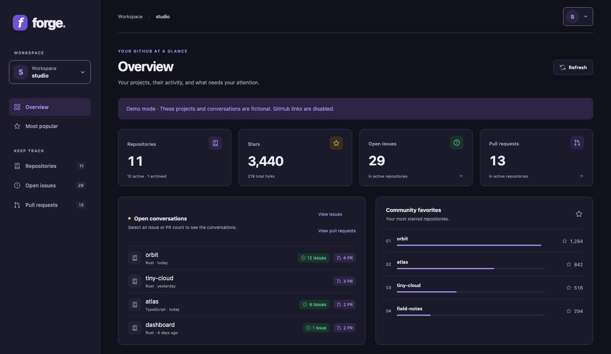

# Forge

Forge brings your GitHub projects into one dashboard, so you can spot what needs attention and get back to maintaining them.
Start with your personal account, switch to an organization, and open the right issues or pull requests directly on GitHub.
Built with Rust and TypeScript, Forge runs as a single server binary.

It can be hosted anywhere; the deployment guide below uses Clever Cloud.



## Features

- Personal and organization workspaces.
- Repository totals and popularity rankings.
- Repository search, filters and sorting on every column.
- Issue and PR inboxes with labels, assignees and review status.
- Direct links to GitHub to reply, review or merge; Forge only reads data.
- Responsive layouts and keyboard navigation.
- Light and dark themes, following your system by default.
- Saved workspace, view, filters and sorting across browser reloads.
- Local GitHub CLI access, hosted GitHub sign-in and a demo without credentials.

## Use

Download the archive for your system from [Releases](https://github.com/davlgd/forge/releases/latest)
and extract it. The `forge` executable contains all web assets; Rust and Bun are not needed.
Install [GitHub CLI](https://cli.github.com/), then run these commands from the extracted folder:

```sh
gh auth login
./forge
```

On Windows, run `.\forge.exe` in PowerShell. Open **http://localhost:8080**;
no configuration file is required. For fictional data, use `DASHBOARD_AUTH=demo ./forge`
or set `$env:DASHBOARD_AUTH="demo"` before launching on Windows.

| System              | Archive target               |
| ------------------- | ---------------------------- |
| Linux x86_64        | `x86_64-unknown-linux-musl`  |
| Linux ARM64         | `aarch64-unknown-linux-musl` |
| macOS Apple Silicon | `aarch64-apple-darwin`       |
| Windows x86_64      | `x86_64-pc-windows-msvc`     |

Linux builds use musl and the system CA certificates. The macOS build requires macOS 11 or later and is [unsigned](https://support.apple.com/en-us/102445).
Each archive has a `.sha256` checksum, also listed in `SHA256SUMS`.
On Linux, verify a downloaded archive with `sha256sum -c <archive>.sha256`; on macOS, use `shasum -a 256 -c <archive>.sha256`.

Choose a workspace, then open **Issues** or **Pull requests**. Search by title, `#number`, repository, author or label; filter by repository, assignee or review status.
Select a conversation to work on it on GitHub, then **Refresh** to update the inbox. In **Repositories**, filter by language or repository type, and click a heading to sort.

Click it again to reverse the order, or select an issue/PR count to open its conversations. Press `/` to search; open your avatar menu to change the theme or sign out.

Synchronization fills all views, prioritizing the current view and displaying results as they arrive.
The server caches results for **30 minutes** per credential and workspace; reloading reuses them after an identity check.
**Refresh** forces an update. Previous results remain visible and marked until their section finishes.

Inboxes include active repositories and forks; repository, star and fork totals also include archives.
PR badges reflect GitHub's review decisions, but approval alone does not guarantee a PR can be merged.

## Deploy on Clever Cloud

Install [Clever Tools](https://www.clever.cloud/developers/doc/cli/install/) and clone the repository below.
Replace `forge.example.com` with your domain throughout this guide.

```sh
git clone https://github.com/davlgd/forge.git
cd forge
clever login
clever create forge --type rust
clever domain add forge.example.com
```

For Paris, the default region, point your domain's CNAME to `domain.par.clever-cloud.com`.
Other regions have their own [DNS targets](https://www.clever.cloud/developers/doc/administrate/domain-names/).

### Create the GitHub OAuth application

Open your GitHub account's [OAuth applications](https://github.com/settings/developers),
choose **New OAuth App**, and fill in:

| Field                      | Value                                       |
| -------------------------- | ------------------------------------------- |
| Application name           | `Forge`                                     |
| Homepage URL               | `https://forge.example.com`                 |
| Authorization callback URL | `https://forge.example.com/oauth2/callback` |

Leave device authorization disabled; disable token expiration if offered.
Register the application, copy its client ID, and generate a client secret.

### Configure and deploy

```sh
cp .env.example .env.deploy
openssl rand -base64 32 | tr '+/' '-_'
```

Edit `.env.deploy` with the client ID, client secret, generated cookie secret, callback URL
and allowed GitHub usernames. This file is excluded from Git; keep its credentials private.

`DASHBOARD_ALLOWED_USERS` accepts comma-separated **GitHub usernames**, not email addresses.
`OAUTH2_PROXY_EMAIL_DOMAINS=*` adds no email restriction; Forge verifies each token and applies the username list.

```sh
clever env import < .env.deploy
clever deploy
```

**Environment import replaces all application variables.** Use the complete template for the new app.
For later deployments, commit your changes and run `clever deploy`.

Open `https://forge.example.com` to sign in on GitHub. Clever Cloud's
[OAuth2 Proxy integration](https://www.clever.cloud/developers/doc/develop/oauth2-proxy/)
handles authentication and forwards the access token to Forge on port `9000`.

The template skips the proxy login screen, returns HTTP 401 to signed-out API clients,
and enables the `/health` deployment check. Bun builds the frontend into the Rust binary.

## Advanced configuration

| Variable                             | Default                 | Purpose                                                                   |
| ------------------------------------ | ----------------------- | ------------------------------------------------------------------------- |
| `PORT`                               | `8080`                  | Listen on `0.0.0.0:$PORT`; use `9000` with Request Flow.                  |
| `DASHBOARD_AUTH`                     | `gh`                    | Local CLI (`gh`), OAuth2 Proxy (`proxy`) or fictional data (`demo`).      |
| `GITHUB_DEFAULT_OWNER`               | Signed-in user          | Initial account or organization.                                          |
| `DASHBOARD_ALLOWED_USERS`            | Unset                   | Required in proxy mode: comma-separated GitHub usernames.                 |
| `DASHBOARD_CACHE_TTL_SECONDS`        | `1800`                  | Cache lifetime in seconds (`1–86400`).                                    |
| `DASHBOARD_MAX_CONCURRENT_SYNCS`     | `4`                     | Synchronizations per instance (`1–64`); excess requests receive HTTP 429. |
| `DASHBOARD_SYNC_TIMEOUT_SECONDS`     | `120`                   | Overall synchronization deadline in seconds (`1–3600`).                   |
| `GITHUB_REQUEST_TIMEOUT_SECONDS`     | `30`                    | GitHub request deadline in seconds (`1–300`).                             |
| `GITHUB_MAX_CONCURRENT_REPOSITORIES` | `4`                     | Concurrent repositories per work-item section (`1–32`).                   |
| `RUST_LOG`                           | `github_dashboard=info` | Server log filter.                                                        |

The server reads process environment variables, not dotenv files. Invalid numeric settings prevent startup.
Runtime settings and server cache limits are centralized in `src/config.rs`.

Each instance caches up to 32 snapshots within 32 MiB; results above 8 MiB stream without being cached.
Restarts clear the cache, and simultaneous requests for an uncached workspace may each fetch it.
GitHub permission changes appear on the next refresh or expiry.

Only interface preferences persist in browser storage; GitHub results stay in server and tab memory.
Filters are scoped to the user and workspace. URL workspace and view parameters override saved choices.

Local `gh` mode accepts only local clients and uses GitHub CLI to obtain the active account's token.
The Rust server sends GitHub requests through [github-rust](https://github.com/davlgd/github-rust) in both authentication modes.

For other hosts, put OAuth2 Proxy in front of Forge and set `DASHBOARD_AUTH=proxy`.
Enable `OAUTH2_PROXY_PASS_ACCESS_TOKEN=true` to forward the token in `X-Forwarded-Access-Token`.
Keep the backend port private and set `DASHBOARD_ALLOWED_USERS` to the allowed GitHub usernames.

Forge supports GitHub.com; organizations may require approval or SSO. The OAuth `repo` scope grants
write permissions, although Forge only reads data. Remove it from `OAUTH2_PROXY_SCOPE` for public repositories only.

## Development and contributions

Install [Rust](https://rustup.rs/) 1.92 or later, [Bun](https://bun.sh/) and [Mise](https://mise.jdx.dev/).
For access to your projects, also install [GitHub CLI](https://cli.github.com/) and run `gh auth login`.
Use `mise run demo` instead of `mise run dev` below to develop without GitHub credentials.

```sh
git clone https://github.com/davlgd/forge.git
cd forge
mise trust
mise run dev
```

Mise provides tasks and optional local `.env` loading; it does not manage tool or dependency versions.
Rust uses edition 2024, and Bun builds the TypeScript assets. Rebuild and restart after frontend changes.

CI runs formatting, Clippy, TypeScript, Rust and browser checks on pushes and pull requests.
Matching `MAJOR.MINOR.PATCH` tags publish tested archives after every platform succeeds.

Before submitting, run `mise run format`, `mise run check` and `mise run test`.
Keep changes focused and describe their effect. See [AGENTS.md](AGENTS.md) for contributor checks
and [CHANGELOG.md](CHANGELOG.md) for release changes.

## License

Copyright 2026 davlgd. Licensed under the [Apache License 2.0](LICENSE).
